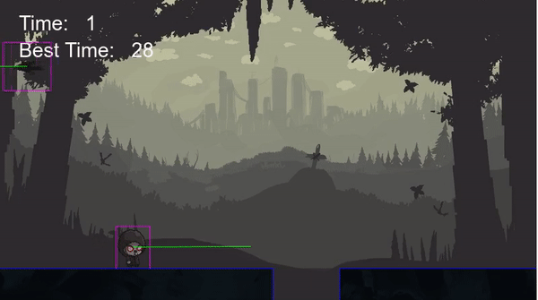

# Demon Runner

Demon Runner is a 2D endless runner game built with popular game framework Phaser. The real inspiration of building this type of endless runner game was google chrome's popular T-Rex. I always wanted to reproduce the T-Rex game with some adjustments and this project gave me opportunity to do just that. The goal is to dodge incoming ravens and avoid fallen down as long as you can.

## Built With

- HTMl,
- CSS,
- Webpack
- Javascript
- Phaser
- LeaderBoard API

## Live Demo

[Live Demo Link](https://misterpaul4.github.io/Demon-Runner/)

## GamePlay

Start by entering your username and then click on "START" to start the game. avoid Ravens and falling off the ground by pressing the spacebar key or UP ARROW key to jump. Click on the button underneath the start button to see if you made it to the TOP TEN :blush:

## Getting Started

- Clone the repository to get a local copy `git clone https://github.com/misterpaul4/Demon-Runner`
- In the project's directory, install dependencies by running `npm install`
- `npm run watch` to compile and watch for changes
- In a new tab or terminal window, `npm run server` to start the game. This will launch your default browser. Click on the folder name "docs".

## Run Test

To run test, run the command `npm run test`. You can add more test in the `./test directory`.

## Technical Details

### scenes

There are 5 Phaser scenes in this game.
- The boot scene loads the game background.
- The preloader scene displays  a progress bar and loads the other assets needed in the title scene.
- The title scene loads the rest of the assets needed in the game such as the audio files, platforms, the player and bird. The title scene also displays a button to start the game, input player username and also view scores.
- The game scene contains the main logic of the game.
- The rank scene dosplays the top 10 highest scores.
- The gameover scene is launched when the player is hit by a bird or falls down from the platform. This scene contains the a button to restart the game & also to quit the game

### characters

- Main character: A demon with the ability to levitate
- Villain: A raven that attacks every few seconds

### timers

- The score increases every second
- The Raven attacks every 3 seconds
- The footstep sound is played every 285ms

### physics

- Arcade physics engine is used
- The Raven's velocity is 50 units less than the player's velocity
- The Raven changes position every 3 seconds, 1000 units ahead of the player's position at that particular time. The y coordinates of the Raven is generated randomly.
- There are 5 total platforms that are recycled throughtout the game

## Authors

👤 **Chukwuebuka Paul Ajuizeogu**
- Github: [@misterpaul4](https://github.com/misterpaul4)
- Twitter: [@paulajuze](https://twitter.com/paulajuze)
- Linkedin: [Chukwuebuka Paul Ajuizeogu](https://www.linkedin.com/in/chukwuebuka-paul-ajuizeogu/)

## Acknowledgments
- [Phaser.io](https://phaser.io/)
- [Microverse](https://www.microverse.org/)
- [OpenGameArt](https://opengameart.org/)
- [Kenney](https://www.kenney.nl/)

## 🤝 Contributing

Contributions, issues and feature requests are welcome!

Feel free to check the [issues page](issues/).

## Show your support

Give a ⭐️ if you like this project!

## 📝 License

This project is [MIT](lic.url) licensed.
