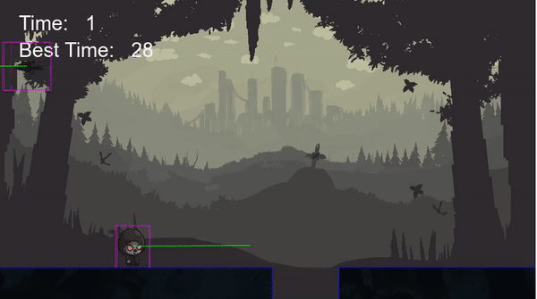

# 希罗快跑

“希罗快跑”是一个基于原项目 [Demon Runner](https://github.com/misterpaul4/Demon-Runner) 二次创作开发的同人跑酷小游戏。

当前仓库不是原版 `Demon Runner` 的直接说明文档，而是这个二创版本的开发仓库。项目保留了横版无尽跑酷的核心玩法，并在视觉、字体和内容表达上做了面向“希罗快跑”的调整。



## 项目说明

- 类型：Phaser 3 横版无尽跑酷游戏
- 前端：React 18 + Vite + TypeScript
- 游戏引擎：Phaser 3
- 运行方式：浏览器本地运行

当前版本是纯本地单机玩法。玩家点击开始后直接进入游戏，通过跳跃躲避障碍并尽可能存活更长时间。游戏会在浏览器本地保存最佳成绩和音效开关状态。

当前版本也已经补上了 Tauri Android 支持：

- 移动端会自动检测并尽量默认横屏
- Android 原生壳默认使用横屏方向启动
- 游戏内支持键盘、鼠标点击和手指点击跳跃

## 原项目来源

本项目基于以下开源仓库进行二次创作：

- 原仓库：<https://github.com/misterpaul4/Demon-Runner>

如果你想看最初版本的玩法、素材组织和项目背景，请直接查看原仓库说明；如果你要运行或继续开发当前这个“希罗快跑”版本，请以本 README 为准。

## 当前功能

- 主菜单和游戏场景
- 本地保存音效开关状态
- 计时与最佳成绩显示
- 游戏结束后重新开始或返回菜单
- 自定义字体显示

## 本地开发

### 1. 安装依赖

```bash
npm install
```

### 2. 启动开发环境

```bash
npm run dev
```

默认会通过 Vite 启动本地开发服务器。

### 3. 生产构建

```bash
npm run build
```

## 玩法

- 点击开始按钮进入游戏
- 使用 `Space` 或 `↑` 进行跳跃
- 在游戏画面中使用鼠标左键或手指点击屏幕也可以跳跃
- 尽量避开敌人和掉落
- 存活时间越长，分数越高

## Tauri Android

### 1. 初始化 Android 工程

如果仓库里还没有 `src-tauri/gen/android`，先执行：

```bash
npm run tauri:android:init
```

### 2. 启动 Android 开发版

连接真机或启动模拟器后执行：

```bash
npm run tauri:android:dev
```

### 3. 打包 Android APK

生成调试 APK：

```bash
npm run tauri:android:build -- --debug --apk -t aarch64 --ci
```

生成发布 APK：

```bash
npm run tauri:android:build -- --apk --ci
```

如果你要拿给真机直接安装，先初始化本地 release 签名：

```bash
npm run tauri:android:signing:init
```

然后再执行发布打包命令。签名成功后，常见输出会变成：

```text
src-tauri/gen/android/app/build/outputs/apk/universal/release/app-universal-release.apk
```

如果你想减小包体，建议按 ABI 分包：

```bash
npm run tauri:android:build -- --apk --split-per-abi --ci
```

常见输出目录：

```text
src-tauri/gen/android/app/build/outputs/apk/
```

### 4. Android 环境变量

当前这套工程依赖以下环境变量：

- `JAVA_HOME`
- `ANDROID_HOME`
- `NDK_HOME`

如果你刚写入过这些变量，记得重开一个终端再执行打包命令。

### 5. Android release 签名文件

本地签名初始化脚本会生成两份只保存在你机器上的文件：

- `src-tauri/gen/android/key.properties`
- `src-tauri/gen/android/keystore/hiro-run-release.jks`

这两份文件已经写进 `.gitignore`，不会被提交进仓库。

## 图标生成

仓库根目录的 `logo.png` 不会被 Tauri 自动读取。Tauri 真正使用的是 [src-tauri/tauri.conf.json](./src-tauri/tauri.conf.json) 里声明的 `src-tauri/icons/*` 文件。

如果你更新了 `logo.png`，现在可以直接执行：

```bash
npm run tauri:icon
```

这个脚本会做两件事：

1. 把 `logo.png` 补成适合做应用图标的方形透明底图
2. 重新生成 `src-tauri/icons` 和 `public/favicon.png`

## 项目结构

```text
src/
  game/
    scenes/        Phaser 场景
  utils/           配置、表单、排行榜等工具代码
public/
  assets/          游戏资源
  fonts/           自定义字体
```

## 说明补充

- 当前仓库中的 README 已按“希罗快跑”版本重写，不再沿用原始 `Demon Runner` 的项目介绍。
- 如果你继续对这个仓库做二创，建议同步更新素材来源、角色设定和版权说明。
- 当前版本已经移除了用户名输入和排行榜流程，后续可以直接接入站点 JWT 身份体系。

## License

当前仓库沿用项目内已有许可证文件，详见 [LICENSE](./LICENSE)。
